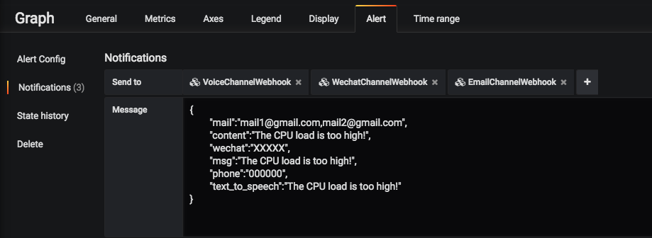
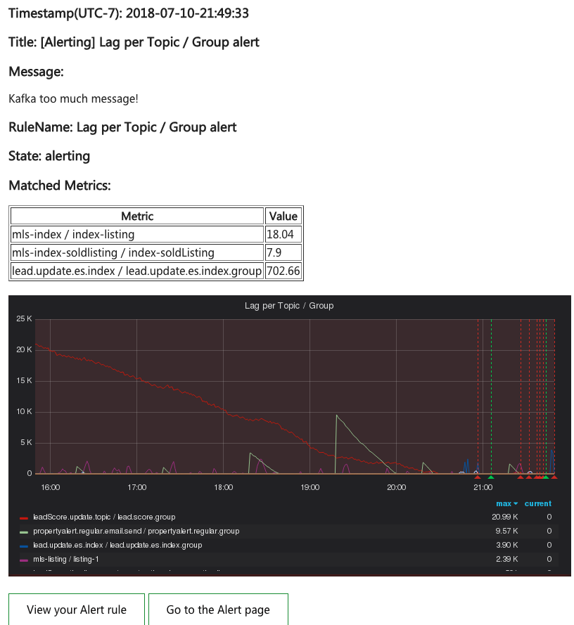
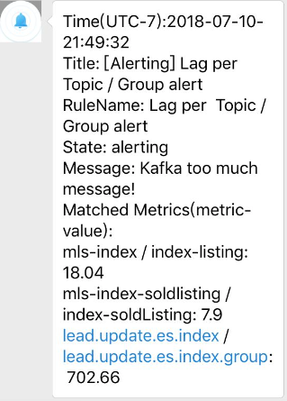

* [Grafana 报警通道 Webhook](#grafana-报警通道-webhook)
    * [Usage:](#usage)
        * [启动服务](#启动服务)
        * [微信通道配置](#微信通道配置)
        * [邮件通道配置 message 中填入如下格式的 json 数据提供报警联系人和信息:](#邮件通道配置-message-中填入如下格式的-json-数据提供报警联系人和信息)
        * [电话通道配置](#电话通道配置)
    * [报警文案](#报警文案)
### Grafana 报警通道 Webhook
Grafana 默认提供的报警通道类型不支持微信和电话，可以自己写个 webhook 来提供，配置报警通道时指定 webhook 的 url，然后 webhook 解析来自 Grafana 发送的请求数据，关于 Grafana 的请求数据类型见[这里](http://docs.grafana.org/alerting/notifications/#external-image-store)。

由于 Grafana 发送的 json 数据格式不能自定义，但是 message 字段可以自定义，所以在 message 中写入格式化数据，然后后台解析 message 字段获取报警接收人和报警信息。

在此提供了邮件、微信、电话三种报警通道的 Webhook，电话通道使用 [Nexmo](https://www.nexmo.com/) 服务。

### Usage:
#### 启动服务
```bash
sh setup_venv.sh # 启动虚拟环境
./manage.py runserver -h 0.0.0.0  #启动服务
```
#### 微信通道配置
配置微信通道时在 message 中填入如下格式的 json 数据提供报警联系人和信息：

>wechat: 报警联系人，如果有多个用逗号隔开

>msg: 自定义报警信息

举例:
```json
{
    "wechat":"name1,name2",
    "msg":"hello, world!"
}
```
#### 邮件通道配置 message 中填入如下格式的 json 数据提供报警联系人和信息:

> mail: 邮件地址，如果有多个则用逗号隔开

> content: 邮件内容

举例：
```json
{
     "mail":"mail1@gmail.com,mail2@gmail.com",
     "content":"The CPU load is too high!"
}
```
#### 电话通道配置
配置电话通道时在 message 中填入如下格式的 json 数据提供报警联系人和信息：
>phone: 电话列表，如果有多个用逗号隔开

>text_to_speech: 语言文本

举例：
```json
{
    "phone":"number1,number2",
    "text_to_speech":"hello, world!"
}
```

如果邮件、微信、电话需要同时配置，则在 `Notifications` 中同时添加邮件、微信、电话通道，在 `Message` 中写入上述 json 数据，举例如下：
```json
{
        "mail":"mail1@gmail.com,mail2@gmail.com",
        "content":"The CPU load is too high!",
        "wechat":"XXXXX",
        "msg":"The CPU load is too high!",
        "phone":"000000",
        "text_to_speech":"The CPU load is too high!"
}
```


### 报警文案
邮件、微信、电话报警通道的文案在 `app/templates` 目录，可以根据需要调整。

**1.邮件报警文案：**



**2.微信报警文案：**



**3.电话报警文案:**

电话报警的文案为配置电话报警是指定的 ```text_to_speech``` 内容

